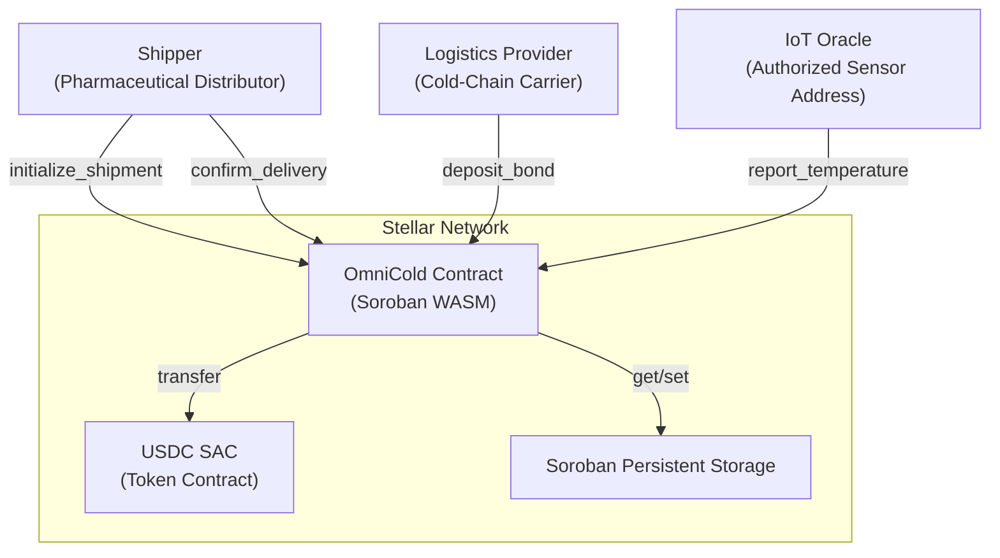
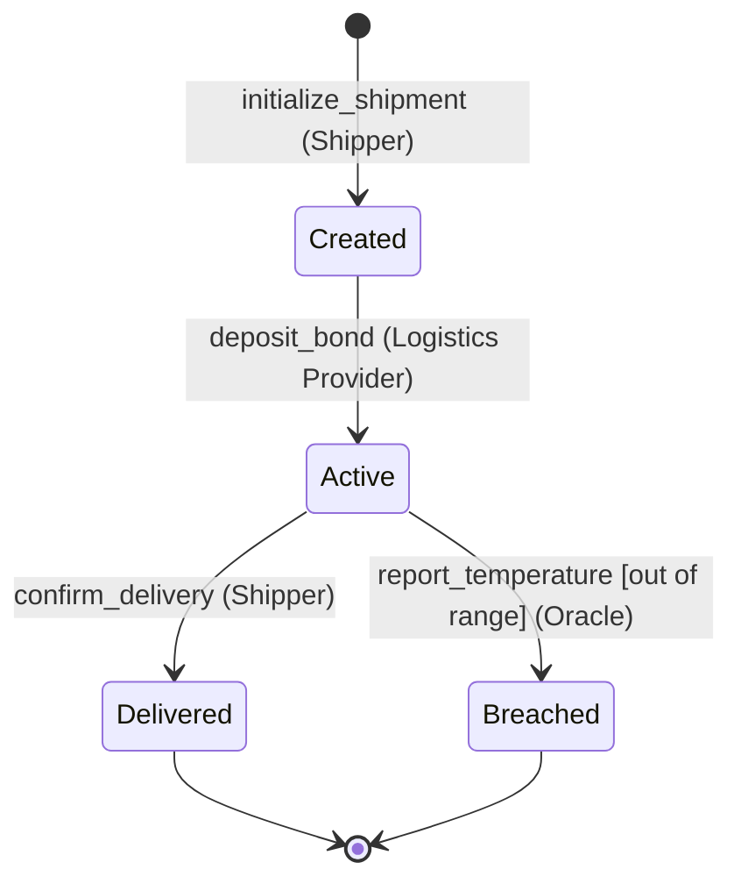
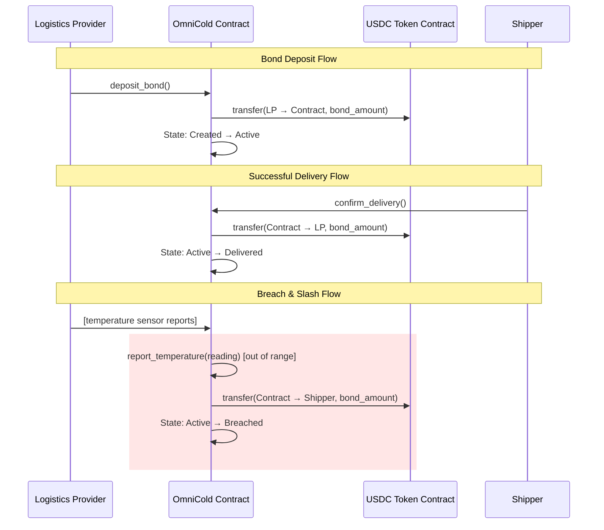
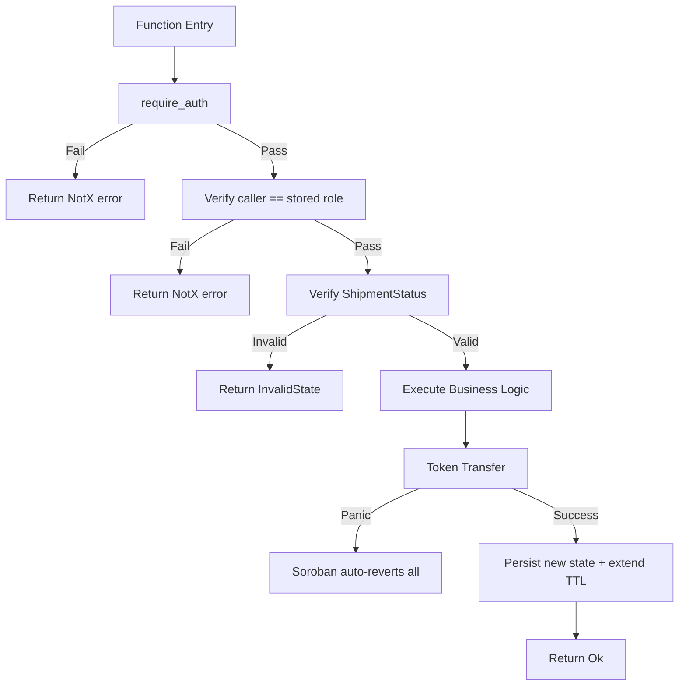

# Design Document — OmniCold Escrow

## Overview

OmniCold Escrow is a Soroban smart contract that manages the lifecycle of temperature-sensitive cargo shipments with automated financial enforcement. The contract acts as a trustless intermediary holding USDC bonds deposited by logistics providers. When an authorized IoT oracle reports a temperature breach, the bond is atomically slashed (transferred to the shipper). When a shipment completes successfully, the bond is returned to the logistics provider.

The contract implements a deterministic state machine with four states (Created → Active → Delivered/Breached) and enforces strict role-based access control: only the designated logistics provider can deposit bonds, only the authorized oracle can report temperatures, and only the shipper can confirm delivery.

### Key Design Decisions

1. **Single-shipment contract**: Each contract instance manages exactly one shipment. This simplifies state management and avoids cross-shipment interference.
2. **Atomic slashing**: Bond transfer and state transition happen in the same invocation — no intermediate states exist where funds could be stuck.
3. **Oracle as Stellar address**: The IoT oracle is represented by a Stellar keypair, enabling native `require_auth()` enforcement without off-chain oracle protocols.
4. **Full bond slashing**: The entire bond is slashed on breach — no partial penalties — simplifying the financial model.
5. **TTL extension on mutation**: Every successful state-mutating call extends storage TTL to prevent archival of active shipment data.

## Architecture

The contract is a single Soroban WASM module deployed to Stellar. It interacts with the USDC Stellar Asset Contract (SAC) for all token movements.



### Shipment Lifecycle State Machine



### Token Flow Diagram



## Components and Interfaces

### Contract Entry Points

All public functions exposed by the `OmniColdContract` impl block:

```rust
#[contract]
pub struct OmniColdContract;

#[contractimpl]
impl OmniColdContract {
    /// Creates a new shipment with temperature thresholds and participant roles.
    /// Caller becomes the Shipper. State → Created.
    pub fn initialize_shipment(
        env: Env,
        usdc_token: Address,      // USDC SAC contract address
        min_temp: i32,            // Minimum threshold (centidegrees Celsius)
        max_temp: i32,            // Maximum threshold (centidegrees Celsius)
        logistics_provider: Address,
        oracle: Address,
        bond_amount: i128,        // USDC amount in stroops
    ) -> Result<(), ContractError>;

    /// Logistics provider deposits the bond. State: Created → Active.
    pub fn deposit_bond(env: Env) -> Result<(), ContractError>;

    /// Oracle reports a temperature reading. If out of range, triggers breach + slash.
    /// State remains Active if in-range; transitions to Breached if out of range.
    pub fn report_temperature(env: Env, temperature: i32) -> Result<(), ContractError>;

    /// Shipper confirms delivery. Bond returned to logistics provider.
    /// State: Active → Delivered.
    pub fn confirm_delivery(env: Env) -> Result<(), ContractError>;
}
```

### Error Type

```rust
#[contracterror]
#[derive(Copy, Clone, Debug, Eq, PartialEq, PartialOrd, Ord)]
#[repr(u32)]
pub enum ContractError {
    AlreadyInitialized = 1,
    InvalidTempRange = 2,
    InvalidBondAmount = 3,
    DuplicateParticipant = 4,
    NotLogisticsProvider = 5,
    NotOracle = 6,
    NotShipper = 7,
    InvalidState = 8,
    TransferFailed = 9,
}
```

### Internal Components

| Component | Responsibility |
|-----------|---------------|
| `initialize_shipment` | Validates inputs, stores shipment config, sets state to Created |
| `deposit_bond` | Authorizes LP, transfers USDC to contract, transitions to Active |
| `report_temperature` | Authorizes oracle, checks range, triggers slash if breached |
| `confirm_delivery` | Authorizes shipper, releases bond to LP, transitions to Delivered |
| `token::Client` | Soroban token interface for USDC transfers |
| `StorageKey` enum | Type-safe keys for persistent storage access |

## Data Models

### Shipment Status Enum

```rust
#[contracttype]
#[derive(Clone, Debug, Eq, PartialEq)]
pub enum ShipmentStatus {
    Created,
    Active,
    Delivered,
    Breached,
}
```

### Storage Key Enum

Uses PascalCase variants as required by project conventions:

```rust
#[contracttype]
#[derive(Clone)]
pub enum StorageKey {
    ShipmentState,       // ShipmentStatus
    MinTemp,             // i32 (centidegrees Celsius)
    MaxTemp,             // i32 (centidegrees Celsius)
    Shipper,             // Address
    LogisticsProvider,   // Address
    Oracle,              // Address
    BondAmount,          // i128 (USDC stroops)
    UsdcToken,           // Address (USDC SAC contract)
}
```

### Storage Layout

All data is stored in Soroban **persistent** storage. Each `StorageKey` variant maps to a single typed value:

| Key | Type | Description |
|-----|------|-------------|
| `ShipmentState` | `ShipmentStatus` | Current lifecycle state |
| `MinTemp` | `i32` | Minimum acceptable temperature (centidegrees) |
| `MaxTemp` | `i32` | Maximum acceptable temperature (centidegrees) |
| `Shipper` | `Address` | Pharmaceutical distributor address |
| `LogisticsProvider` | `Address` | Cold-chain carrier address |
| `Oracle` | `Address` | Authorized IoT sensor address |
| `BondAmount` | `i128` | USDC bond amount in stroops |
| `UsdcToken` | `Address` | USDC SAC contract address |

### Storage Access Pattern

```rust
// Write
env.storage().persistent().set(&StorageKey::ShipmentState, &ShipmentStatus::Created);

// Read
let status: ShipmentStatus = env.storage().persistent().get(&StorageKey::ShipmentState).unwrap();

// Check existence (for initialization guard)
let exists: bool = env.storage().persistent().has(&StorageKey::ShipmentState);

// TTL extension on every mutation
env.storage().persistent().extend_ttl(&key, LIFETIME_THRESHOLD, BUMP_AMOUNT);
```

### TTL Constants

```rust
const LIFETIME_THRESHOLD: u32 = 17_280;  // ~1 day in ledgers
const BUMP_AMOUNT: u32 = 518_400;        // ~30 days in ledgers
```


## Correctness Properties

*A property is a characteristic or behavior that should hold true across all valid executions of a system — essentially, a formal statement about what the system should do. Properties serve as the bridge between human-readable specifications and machine-verifiable correctness guarantees.*

### Property 1: Initialization Storage Round-Trip

*For any* valid set of initialization parameters (min_temp < max_temp, positive bond_amount, distinct participant addresses), after calling `initialize_shipment`, reading back each stored field SHALL produce a value equal to the originally supplied parameter, and the shipment state SHALL be `Created`.

**Validates: Requirements 1.1, 9.3**

### Property 2: Initialization Rejects Invalid Inputs

*For any* initialization attempt where at least one of the following conditions holds — (a) min_temp >= max_temp, (b) bond_amount <= 0, or (c) logistics_provider or oracle address equals the shipper address — the contract SHALL return an error and no shipment data SHALL be persisted to storage.

**Validates: Requirements 1.2, 1.4, 1.5**

### Property 3: Access Control Enforcement

*For any* address that is not the designated authorized caller for a given function (non-LP for `deposit_bond`, non-Oracle for `report_temperature`, non-Shipper for `confirm_delivery`), invoking that function SHALL return an authorization error, and no storage values, token balances, or shipment state SHALL be modified.

**Validates: Requirements 2.3, 3.3, 5.3, 7.1, 7.2, 7.3, 7.4, 7.5**

### Property 4: State Machine Integrity

*For any* shipment in a given `ShipmentStatus`, only the valid transitions SHALL succeed: Created→Active (via `deposit_bond`), Active→Delivered (via `confirm_delivery`), Active→Breached (via `report_temperature` with out-of-range reading). All other function invocations that would require a different source state SHALL be rejected with a state error, and the shipment state SHALL remain unchanged.

**Validates: Requirements 1.3, 2.4, 3.4, 5.4, 6.1, 6.2, 6.3, 8.1, 8.2, 8.3, 8.4, 8.5, 8.6, 8.7**

### Property 5: In-Range Temperature Preserves Active State

*For any* active shipment with temperature thresholds [min_temp, max_temp], and *for any* temperature reading `t` where `min_temp <= t <= max_temp`, calling `report_temperature(t)` SHALL leave the shipment state as `Active` and SHALL NOT trigger any token transfer.

**Validates: Requirements 3.1, 4.4**

### Property 6: Out-of-Range Temperature Triggers Atomic Slash

*For any* active shipment with temperature thresholds [min_temp, max_temp] and bond amount `B`, and *for any* temperature reading `t` where `t < min_temp` OR `t > max_temp`, calling `report_temperature(t)` SHALL atomically transfer the full amount `B` in USDC from the contract to the shipper address AND transition the shipment state to `Breached`.

**Validates: Requirements 3.2, 4.1, 4.2, 4.3**

### Property 7: Delivery Confirmation Releases Full Bond to Logistics Provider

*For any* active shipment with bond amount `B`, when the shipper calls `confirm_delivery`, the contract SHALL transfer the full amount `B` in USDC from the contract to the logistics provider address AND transition the shipment state to `Delivered`.

**Validates: Requirements 5.1, 5.2**

## Error Handling

### Error Strategy

The contract uses a `ContractError` enum with numeric codes for all failure modes. Soroban's transaction model guarantees atomic rollback on any panic or error return — no partial state changes persist.

### Error Codes and Triggers

| Error | Code | Trigger Condition |
|-------|------|-------------------|
| `AlreadyInitialized` | 1 | `initialize_shipment` called when shipment already exists |
| `InvalidTempRange` | 2 | `min_temp >= max_temp` during initialization |
| `InvalidBondAmount` | 3 | `bond_amount <= 0` during initialization |
| `DuplicateParticipant` | 4 | LP or Oracle address equals Shipper |
| `NotLogisticsProvider` | 5 | Non-LP address calls `deposit_bond` |
| `NotOracle` | 6 | Non-Oracle address calls `report_temperature` |
| `NotShipper` | 7 | Non-Shipper address calls `confirm_delivery` |
| `InvalidState` | 8 | Function called in wrong shipment state |
| `TransferFailed` | 9 | USDC token transfer fails (Soroban will panic/revert) |

### Error Handling Patterns

1. **Input Validation**: Check all preconditions before any state mutation. Return typed error immediately on failure.
2. **Access Control**: Call `Address::require_auth()` first in every function, then verify the caller matches the stored authorized address.
3. **State Guards**: Check `ShipmentStatus` matches expected state before proceeding with logic.
4. **Token Transfer Failures**: Soroban's host function calls panic on failure, which automatically reverts the entire transaction including any state changes made earlier in the same invocation. This guarantees atomicity without explicit rollback code.
5. **Storage Absence**: Use `.has()` to check initialization before `.get()` to avoid panics on uninitialized access.

### Error Propagation Flow



## Testing Strategy

### Unit Testing (5 Required Scenarios)

The contract requires exactly 5 test scenarios using `soroban_sdk::testutils`:

| # | Test | What it Validates |
|---|------|-------------------|
| 1 | `test_happy_path` | Full lifecycle: initialize → deposit → in-range reports → confirm delivery → bond returned to LP |
| 2 | `test_unauthorized_reporter` | Non-oracle address calls `report_temperature` → rejected with `NotOracle` error, state unchanged |
| 3 | `test_state_after_breach` | Out-of-range report → state transitions to `Breached`, bond transferred to shipper, further reports rejected |
| 4 | `test_duplicate_report_protection` | After breach, second `report_temperature` call → rejected with `InvalidState`, no second transfer |
| 5 | `test_initialization_state` | After `initialize_shipment`, verify all stored fields match inputs and state is `Created` |

### Property-Based Testing

Property-based tests complement the 5 unit test scenarios by verifying universal invariants across randomized inputs.

**Library**: `proptest` crate (compatible with `no_std` via `soroban-sdk` test environment)

**Configuration**: Minimum 100 iterations per property test.

**Tag format**: `// Feature: omnicold-escrow, Property {N}: {title}`

Each of the 7 correctness properties defined above maps to a single property-based test:

1. **Property 1 test**: Generate random valid params (i32 temps where min < max, random addresses, positive i128 bond). Initialize, read back all fields, assert equality.
2. **Property 2 test**: Generate random invalid param combinations (min >= max, bond <= 0, duplicate addresses). Attempt initialization, assert error and no state.
3. **Property 3 test**: Generate random unauthorized addresses for each function. Invoke with wrong caller, assert error and no state/balance change.
4. **Property 4 test**: For each `ShipmentStatus`, generate random function calls. Assert only legal transitions succeed; illegal ones fail with state unchanged.
5. **Property 5 test**: Generate random threshold pairs and random in-range temperatures. Report, assert state remains Active and no transfer.
6. **Property 6 test**: Generate random thresholds and out-of-range temperatures. Report, assert state is Breached and bond amount transferred to shipper.
7. **Property 7 test**: Generate random active shipments with varying bond amounts. Confirm delivery, assert bond transferred to LP and state is Delivered.

### Test Architecture

```
contracts/omnicold/src/test.rs
├── Unit tests (5 scenarios — soroban_sdk::testutils)
│   ├── test_happy_path
│   ├── test_unauthorized_reporter
│   ├── test_state_after_breach
│   ├── test_duplicate_report_protection
│   └── test_initialization_state
└── Property tests (7 properties — proptest)
    ├── prop_initialization_round_trip
    ├── prop_initialization_rejects_invalid
    ├── prop_access_control_enforcement
    ├── prop_state_machine_integrity
    ├── prop_in_range_preserves_active
    ├── prop_out_of_range_triggers_slash
    └── prop_delivery_releases_bond
```

### Test Environment Setup

Each test creates a fresh Soroban test environment with:
- Registered OmniCold contract
- Registered mock USDC token (using `soroban_sdk::token::StellarAssetClient` for minting)
- Generated test addresses for shipper, logistics provider, oracle, and unauthorized users
- Pre-minted USDC balances for the logistics provider

