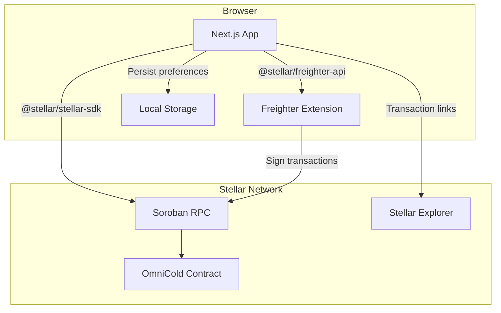
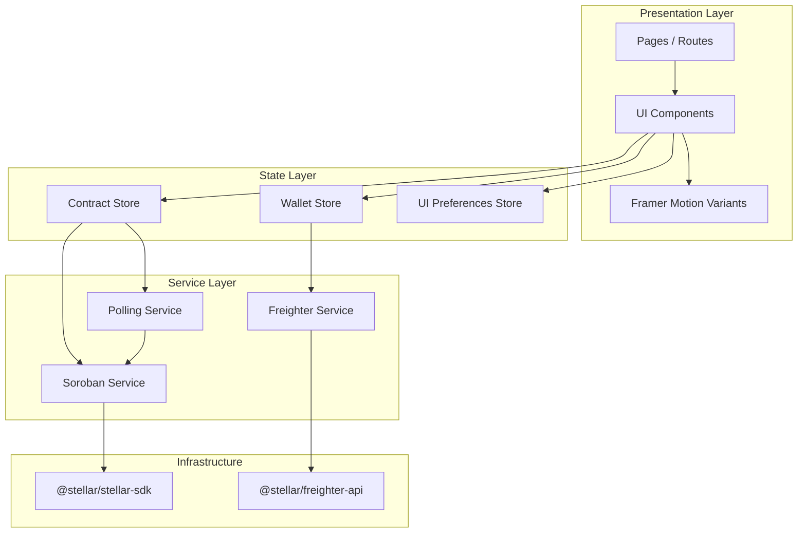
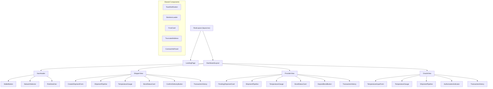
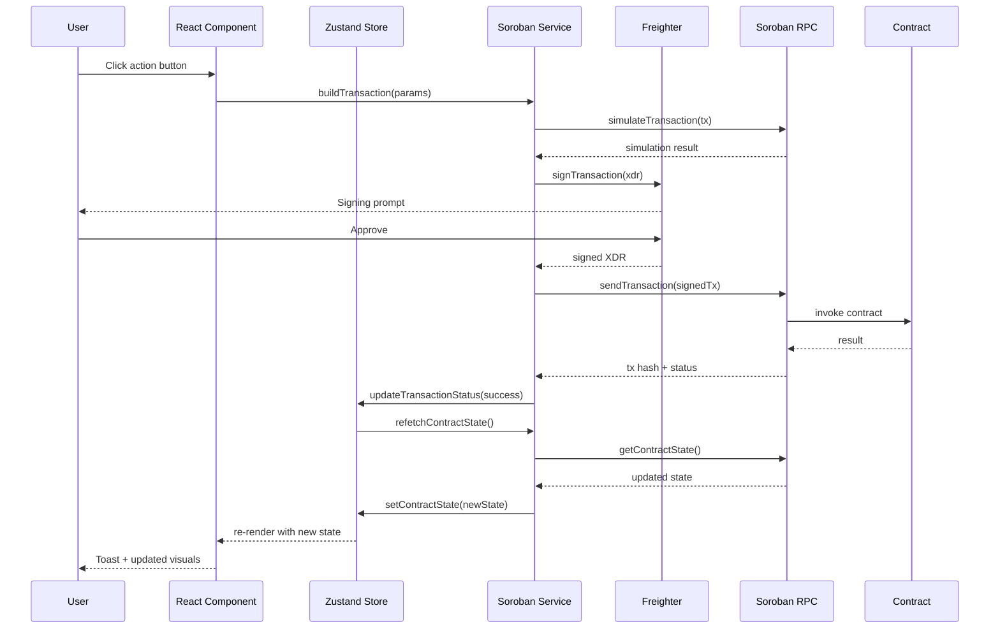
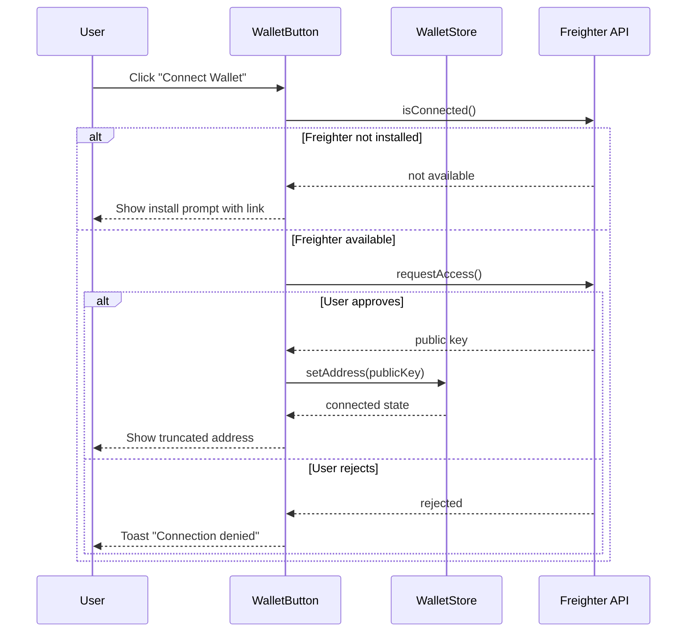
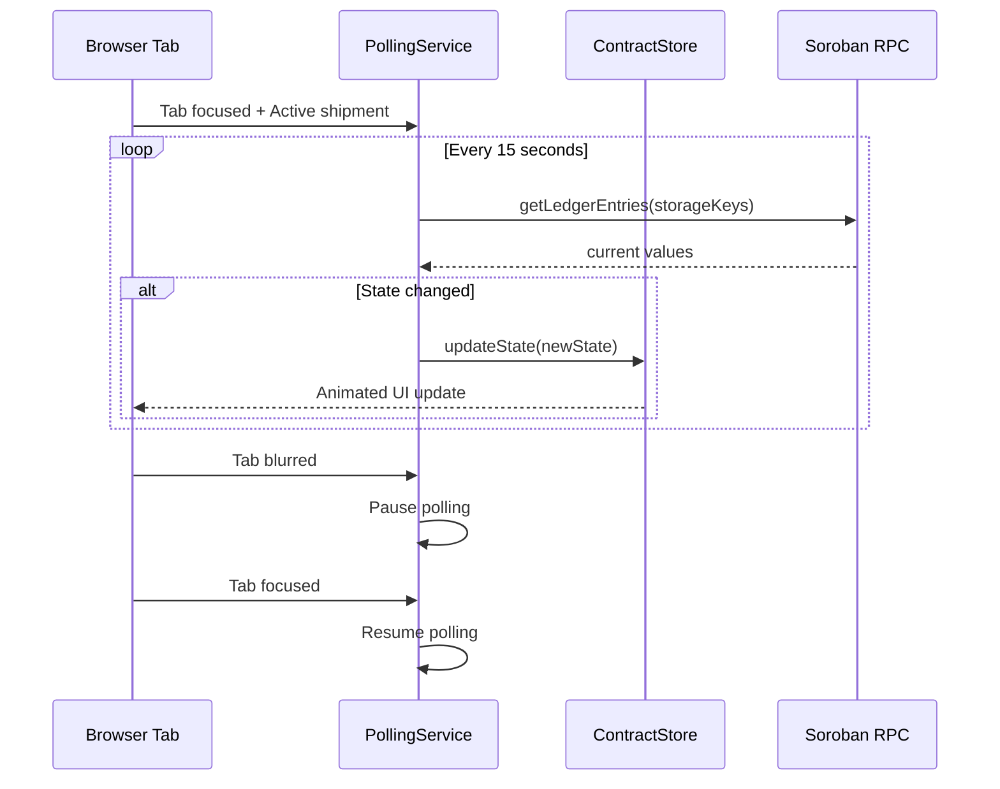

# Design Document: OmniCold Frontend Dashboard

## Overview

The OmniCold Frontend is a Next.js 14 App Router application that provides a role-based dashboard for interacting with the OmniCold Soroban escrow smart contract on Stellar. The frontend communicates directly with the blockchain via Soroban RPC — no backend server is required.

The application serves three user roles (Shipper, Logistics Provider, Oracle) through a single-page experience with role switching. It uses Freighter wallet for authentication and transaction signing, Zustand for state management, Tailwind CSS with a custom arctic dark theme for styling, and Framer Motion for ice-themed microinteractions.

### Key Design Decisions

| Decision | Rationale |
|----------|-----------|
| Next.js 14 App Router | Server components for initial page load, client components for wallet interaction and animations |
| Zustand over Redux | Lightweight, minimal boilerplate, multiple stores for separation of concerns |
| Tailwind CSS custom theme | Semantic color tokens (`arctic-navy`, `frost-cyan`) map directly to design requirements |
| Framer Motion | First-class React integration, layout animations, spring physics for gauge needle |
| Recharts | Composable, responsive charting for temperature timeline visualization |
| Direct Soroban RPC | No backend needed — the contract is the API |

## Architecture

### High-Level Architecture



### Application Architecture Layers



## Components and Interfaces

### Component Hierarchy



### Page Routing (App Router)

| Route | Component | Description |
|-------|-----------|-------------|
| `/` | `LandingPage` | Brand page with wallet connect CTA |
| `/dashboard` | `DashboardLayout` | Authenticated dashboard shell |
| `/dashboard/shipper` | `ShipperView` | Shipper role interface |
| `/dashboard/provider` | `ProviderView` | Logistics Provider interface |
| `/dashboard/oracle` | `OracleView` | Oracle operator interface |

### Key Component Interfaces

```typescript
// ShipmentPipeline
interface ShipmentPipelineProps {
  currentState: ShipmentStatus;
  lastTransitionTimestamp?: number;
  animated?: boolean;
}

// TemperatureGauge
interface TemperatureGaugeProps {
  currentTemp: number;       // centidegrees
  previousTemp?: number;     // for trend indicator
  minThreshold: number;      // centidegrees
  maxThreshold: number;      // centidegrees
}

// BondStatusCard
interface BondStatusCardProps {
  amount: bigint;            // USDC in stroops
  status: 'held' | 'released' | 'slashed';
  contractAddress: string;
  recipientAddress?: string;
  lastChangeTimestamp?: number;
}

// TransactionHistory
interface TransactionHistoryProps {
  transactions: TransactionEntry[];
  network: 'testnet' | 'mainnet';
}

// RoleSwitcher
interface RoleSwitcherProps {
  activeRole: UserRole;
  onRoleChange: (role: UserRole) => void;
}

// NetworkSelector
interface NetworkSelectorProps {
  activeNetwork: StellarNetwork;
  onNetworkChange: (network: StellarNetwork) => void;
  isTransactionPending: boolean;
}

// CreateShipmentForm
interface CreateShipmentFormProps {
  connectedAddress: string;
  onSubmit: (params: InitializeShipmentParams) => Promise<void>;
}
```

### Data Flow: Transaction Lifecycle



### Data Flow: Wallet Connection



### Data Flow: RPC Polling



## Data Models

### TypeScript Types

```typescript
// Contract state mirroring on-chain storage
type ShipmentStatus = 'Created' | 'Active' | 'Delivered' | 'Breached';
type StellarNetwork = 'testnet' | 'mainnet';
type UserRole = 'shipper' | 'provider' | 'oracle';
type BondStatus = 'held' | 'released' | 'slashed';

interface ContractState {
  shipmentStatus: ShipmentStatus;
  minTemp: number;           // centidegrees Celsius (i32)
  maxTemp: number;           // centidegrees Celsius (i32)
  shipper: string;           // Stellar address
  logisticsProvider: string; // Stellar address
  oracle: string;            // Stellar address
  bondAmount: bigint;        // i128 (stroops)
  usdcToken: string;         // Stellar address
}

interface TransactionEntry {
  id: string;
  type: 'initialize' | 'deposit_bond' | 'report_temperature' | 'confirm_delivery' | 'breach_slash';
  invokerAddress: string;
  timestamp: number;
  txHash: string;
  status: 'success' | 'failure';
  metadata?: {
    temperature?: number;    // for report_temperature
    amount?: bigint;         // for deposit/release/slash
  };
}

interface InitializeShipmentParams {
  shipper: string;
  usdcToken: string;
  minTemp: number;
  maxTemp: number;
  logisticsProvider: string;
  oracle: string;
  bondAmount: bigint;
}

// Temperature zone classification
type TemperatureZone = 'safe' | 'warning' | 'breach';

interface TemperatureReading {
  value: number;          // centidegrees
  zone: TemperatureZone;
  trend: 'up' | 'down' | 'stable';
  timestamp: number;
}
```

### Zustand Store Design

```typescript
// Wallet Store
interface WalletState {
  address: string | null;
  isConnected: boolean;
  isConnecting: boolean;
  network: StellarNetwork;
  connect: () => Promise<void>;
  disconnect: () => void;
  setNetwork: (network: StellarNetwork) => void;
}

// Contract Store
interface ContractStoreState {
  contractState: ContractState | null;
  isLoading: boolean;
  error: string | null;
  lastFetchedAt: number | null;
  transactions: TransactionEntry[];
  fetchContractState: () => Promise<void>;
  submitTransaction: (type: string, params: unknown) => Promise<string>;
  isTransactionPending: boolean;
}

// UI Preferences Store
interface UIState {
  activeRole: UserRole;
  setActiveRole: (role: UserRole) => void;
  reducedMotion: boolean;
  setReducedMotion: (value: boolean) => void;
}
```

### Soroban Integration Layer

The service layer wraps `@stellar/stellar-sdk` to provide typed contract interaction methods:

```typescript
class SorobanService {
  private server: SorobanRpc.Server;
  private contractId: string;
  private networkPassphrase: string;

  constructor(network: StellarNetwork) {
    const config = NETWORK_CONFIG[network];
    this.server = new SorobanRpc.Server(config.rpcUrl);
    this.contractId = config.contractId;
    this.networkPassphrase = config.passphrase;
  }

  // Read contract storage keys
  async getContractState(): Promise<ContractState> { /* ... */ }

  // Build unsigned transaction XDR
  async buildInitializeShipment(params: InitializeShipmentParams): Promise<string> { /* ... */ }
  async buildDepositBond(logisticsProvider: string): Promise<string> { /* ... */ }
  async buildReportTemperature(oracle: string, temperature: number): Promise<string> { /* ... */ }
  async buildConfirmDelivery(shipper: string): Promise<string> { /* ... */ }

  // Submit signed transaction
  async submitTransaction(signedXdr: string): Promise<TransactionResult> { /* ... */ }

  // Parse contract errors from failed transactions
  parseContractError(error: unknown): ContractError | null { /* ... */ }
}
```

### Network Configuration

```typescript
const NETWORK_CONFIG = {
  testnet: {
    rpcUrl: 'https://soroban-testnet.stellar.org',
    passphrase: 'Test SDF Network ; September 2015',
    contractId: process.env.NEXT_PUBLIC_TESTNET_CONTRACT_ID,
    explorerUrl: 'https://stellar.expert/explorer/testnet',
  },
  mainnet: {
    rpcUrl: 'https://soroban-rpc.mainnet.stellar.gateway.fm',
    passphrase: 'Public Global Stellar Network ; September 2015',
    contractId: process.env.NEXT_PUBLIC_MAINNET_CONTRACT_ID,
    explorerUrl: 'https://stellar.expert/explorer/public',
  },
} as const;
```

### Color System / Design Tokens (Tailwind Configuration)

```typescript
// tailwind.config.ts
const config = {
  darkMode: 'class',
  theme: {
    extend: {
      colors: {
        arctic: {
          navy: '#0F1923',       // Primary background
          deep: '#1B2A4A',       // Navigation, headers
          slate: '#1E293B',      // Card surfaces
        },
        frost: {
          cyan: '#00D4FF',       // Active states, primary interactive
          white: '#F1FAEE',      // Primary text
          gray: '#94A3B8',       // Secondary text
        },
        status: {
          safe: '#2EC4B6',       // Mint Green — success, delivered
          warning: '#FF9F1C',    // Amber — warning zone
          breach: '#E63946',     // Red — error, breach
        },
      },
      boxShadow: {
        'frost-glow': '0 0 20px rgba(0, 212, 255, 0.12)',
        'frost-hover': '0 0 30px rgba(0, 212, 255, 0.15)',
      },
      backgroundImage: {
        'frost-gradient': 'linear-gradient(135deg, transparent, rgba(0, 212, 255, 0.05))',
        'card-border': 'linear-gradient(180deg, transparent, rgba(0, 212, 255, 0.2))',
      },
      animation: {
        'pulse-amber': 'pulse 1s ease-in-out infinite',
        'pulse-breach': 'pulse 0.5s ease-in-out infinite',
        'frost-spread': 'frostSpread 500ms ease-out',
      },
    },
  },
};
```

### Animation System (Framer Motion Variants)

```typescript
// Shared animation variants
export const animationVariants = {
  // Page transitions
  frostWipe: {
    initial: { clipPath: 'inset(0 100% 0 0)' },
    animate: { clipPath: 'inset(0 0% 0 0)', transition: { duration: 0.3 } },
    exit: { clipPath: 'inset(0 0 0 100%)', transition: { duration: 0.3 } },
  },

  // Content reveal (frost-thaw)
  frostThaw: {
    initial: { opacity: 0, filter: 'blur(8px)', scale: 0.98 },
    animate: { opacity: 1, filter: 'blur(0px)', scale: 1, transition: { duration: 0.4 } },
  },

  // Toast slide-in
  toastEnter: {
    initial: { x: 100, opacity: 0 },
    animate: { x: 0, opacity: 1, transition: { type: 'spring', stiffness: 300, damping: 25 } },
    exit: { opacity: 0, filter: 'blur(4px)', transition: { duration: 0.2 } },
  },

  // Pipeline frost-spread
  pipelineTransition: {
    initial: { pathLength: 0 },
    animate: { pathLength: 1, transition: { duration: 0.5, ease: 'easeOut' } },
  },

  // Gauge needle (spring physics)
  gaugeNeedle: {
    animate: (rotation: number) => ({
      rotate: rotation,
      transition: { type: 'spring', stiffness: 100, damping: 15 },
    }),
  },

  // Frost crystallization (button loading)
  crystallize: {
    animate: {
      scale: [1, 1.02, 1],
      opacity: [1, 0.8, 1],
      transition: { repeat: Infinity, duration: 1.2 },
    },
  },

  // Bond card thaw (released)
  bondThaw: {
    initial: { borderColor: '#00D4FF' },
    animate: { borderColor: '#2EC4B6', transition: { duration: 0.8 } },
  },

  // Bond card crack (slashed)
  bondCrack: {
    initial: { borderColor: '#00D4FF' },
    animate: { borderColor: '#E63946', transition: { duration: 0.4 } },
  },
};

// Reduced motion wrapper
export function useAnimationVariant(variant: object) {
  const prefersReduced = useReducedMotion();
  return prefersReduced ? {} : variant;
}
```

### Responsive Design Strategy

| Breakpoint | Layout | Behavior |
|------------|--------|----------|
| `< 768px` (mobile) | Single column | Pipeline vertical, cards full-width, 44px touch targets, 16px min font |
| `768px–1023px` (tablet) | Two columns | Pipeline horizontal, side-by-side cards |
| `≥ 1024px` (desktop) | Multi-column grid | Pipeline full-width span, 3-column grid below |

**Mobile-First Approach:**
- Base styles target mobile (single column, stacked)
- `md:` prefix adds tablet breakpoints
- `lg:` prefix adds desktop grid layout
- Touch targets enforced via `min-h-11 min-w-11` utility
- Text legibility via `text-base` (16px) minimum on body

### Directory Structure

```
frontend/
├── app/
│   ├── layout.tsx                    # Root layout (dark mode, fonts)
│   ├── page.tsx                      # Landing page
│   ├── globals.css                   # Tailwind directives + custom CSS
│   └── dashboard/
│       ├── layout.tsx                # Dashboard shell (nav header)
│       ├── page.tsx                  # Redirect to default role
│       ├── shipper/
│       │   └── page.tsx              # Shipper view
│       ├── provider/
│       │   └── page.tsx              # Provider view
│       └── oracle/
│           └── page.tsx              # Oracle view
├── components/
│   ├── layout/
│   │   ├── NavHeader.tsx
│   │   ├── WalletButton.tsx
│   │   ├── NetworkSelector.tsx
│   │   └── RoleSwitcher.tsx
│   ├── shipment/
│   │   ├── ShipmentPipeline.tsx
│   │   ├── TemperatureGauge.tsx
│   │   ├── BondStatusCard.tsx
│   │   └── TransactionHistory.tsx
│   ├── forms/
│   │   ├── CreateShipmentForm.tsx
│   │   └── TemperatureInputForm.tsx
│   ├── shared/
│   │   ├── FrostCard.tsx
│   │   ├── ToastNotification.tsx
│   │   ├── SkeletonLoader.tsx
│   │   ├── TruncatedAddress.tsx
│   │   ├── ContractInfoPanel.tsx
│   │   └── LoadingButton.tsx
│   └── landing/
│       ├── LandingHero.tsx
│       ├── AuroraBackground.tsx
│       └── RoleCards.tsx
├── stores/
│   ├── walletStore.ts
│   ├── contractStore.ts
│   └── uiStore.ts
├── services/
│   ├── soroban.ts                   # SorobanService class
│   ├── freighter.ts                 # Freighter wrapper
│   └── polling.ts                   # RPC polling manager
├── lib/
│   ├── constants.ts                 # Network config, error messages
│   ├── types.ts                     # Shared TypeScript types
│   ├── animations.ts               # Framer Motion variants
│   ├── utils.ts                     # Address truncation, temp conversion
│   └── errors.ts                    # Contract error code mapping
├── hooks/
│   ├── useContractState.ts
│   ├── useWallet.ts
│   ├── useTransaction.ts
│   └── usePolling.ts
├── public/
│   ├── icons/                       # Role icons, status icons
│   └── fonts/
├── tailwind.config.ts
├── next.config.js
├── package.json
└── tsconfig.json
```

## Error Handling

### Contract Error Code Mapping

The frontend maps all 9 contract error codes to user-friendly messages:

```typescript
const CONTRACT_ERROR_MAP: Record<number, { message: string; severity: 'error' | 'warning' }> = {
  1: { message: 'A shipment has already been created for this contract.', severity: 'error' },
  2: { message: 'Minimum temperature must be less than maximum temperature.', severity: 'error' },
  3: { message: 'Bond amount must be greater than zero.', severity: 'error' },
  4: { message: 'All participant addresses must be unique.', severity: 'error' },
  5: { message: 'Only the designated Logistics Provider can perform this action.', severity: 'error' },
  6: { message: 'Only the authorized Oracle can report temperatures.', severity: 'error' },
  7: { message: 'Only the Shipper can confirm delivery.', severity: 'error' },
  8: { message: 'This action is not available in the current shipment state.', severity: 'error' },
  9: { message: 'USDC transfer failed — check balance and allowance.', severity: 'error' },
};
```

### Error Handling Strategy

| Error Source | Handling | User Feedback |
|-------------|----------|---------------|
| Contract error codes (1–9) | Parse from transaction result, map to message | Toast (Breach Red, 5s+, dismissible) |
| Network timeout / RPC unreachable | Catch in service layer, set error state | Toast (Warning Amber) + Retry button |
| Freighter not installed | Check `isConnected()` on mount | Inline message with install link |
| Freighter connection rejected | Catch rejection from `requestAccess()` | Toast (Warning Amber) |
| Form validation failures | Client-side validation before TX build | Inline field errors (red border + message) |
| Transaction simulation failure | Check simulation result before signing | Toast with simulation error detail |

### Client-Side Validation Rules

```typescript
interface ValidationRules {
  temperature: {
    minLessThanMax: (min: number, max: number) => min < max;
  };
  bondAmount: {
    positive: (amount: bigint) => amount > 0n;
  };
  addresses: {
    distinctFromSelf: (addr: string, self: string) => addr !== self;
    validStellar: (addr: string) => StrKey.isValidEd25519PublicKey(addr);
  };
}
```

### Toast Notification Behavior

| Type | Color | Duration | Dismissible |
|------|-------|----------|-------------|
| Success | Mint Green (#2EC4B6) | 4 seconds auto-dismiss | Yes |
| Error (contract) | Breach Red (#E63946) | 5+ seconds | Yes (manual) |
| Warning (network) | Warning Amber (#FF9F1C) | Persistent until retry | Yes |


## Correctness Properties

*A property is a characteristic or behavior that should hold true across all valid executions of a system — essentially, a formal statement about what the system should do. Properties serve as the bridge between human-readable specifications and machine-verifiable correctness guarantees.*

### Property 1: Address Truncation Preserves Endpoints

*For any* valid Stellar Ed25519 public key, the `truncateAddress` function SHALL produce a string containing exactly the first 4 characters, followed by an ellipsis separator, followed by the last 4 characters of the original address.

**Validates: Requirements 1.2**

### Property 2: Network Preference Persistence Round-Trip

*For any* valid network selection ('testnet' or 'mainnet'), storing the preference to localStorage and then reading it back SHALL return the same network value that was stored.

**Validates: Requirements 2.4**

### Property 3: Create Shipment Form Validation Correctness

*For any* combination of form inputs (minTemp, maxTemp, bondAmount, logisticsProvider address, oracle address, connected wallet address), the validation function SHALL reject the submission if and only if at least one of the following holds: minTemp >= maxTemp, bondAmount <= 0, or any participant address equals the connected wallet address.

**Validates: Requirements 3.3, 3.4, 3.5**

### Property 4: Temperature Zone Classification

*For any* temperature value (integer centidegrees) and any valid threshold pair (minTemp < maxTemp), the `classifyTemperatureZone` function SHALL return 'breach' if the value is outside [min, max], 'warning' if within 10% of a threshold boundary but still inside, and 'safe' otherwise — and these three zones SHALL be mutually exclusive and collectively exhaustive.

**Validates: Requirements 4.3, 11.1, 22.2**

### Property 5: USDC Bond Amount Formatting

*For any* non-negative bigint value representing a USDC amount in stroops, the `formatUsdcAmount` function SHALL produce a string with exactly 2 decimal places that, when parsed back to a numeric value and multiplied by the appropriate factor, equals the original input.

**Validates: Requirements 9.2, 23.1**

### Property 6: Elapsed Time Formatting

*For any* timestamp in the past (between 1 second ago and 365 days ago), the `formatElapsedTime` function SHALL produce a non-empty human-readable string containing a numeric value and a time unit label (e.g., "2h 34m", "5d 12h"), and the formatted value SHALL be monotonically non-decreasing as the time difference increases.

**Validates: Requirements 13.7**

### Property 7: Contract Error Code Mapping Completeness

*For any* integer error code in the range [1, 9], the `mapContractError` function SHALL return a non-empty human-readable string that does not equal a generic fallback message, and for any integer outside [1, 9], it SHALL return a generic unknown error message.

**Validates: Requirements 16.1**

### Property 8: Centidegree to Display Degree Conversion Round-Trip

*For any* integer centidegree value, converting to display degrees (dividing by 100, formatting to 1 decimal place) and then parsing the display string back to centidegrees (multiplying by 100, rounding) SHALL produce a value within ±5 of the original input (accounting for display rounding to 1 decimal).

**Validates: Requirements 22.1**

### Property 9: Temperature Trend Classification

*For any* two integer temperature values (current and previous), the `classifyTrend` function SHALL return 'up' if current > previous, 'down' if current < previous, and 'stable' if current equals previous — and the result SHALL always be exactly one of these three values.

**Validates: Requirements 22.8**

## Testing Strategy

### Property-Based Testing

**Library:** [fast-check](https://github.com/dubzzz/fast-check) (TypeScript PBT library)

**Configuration:**
- Minimum 100 iterations per property test
- Each test tagged with: `Feature: omnicold-frontend, Property {N}: {title}`

**Properties to implement:**

| Property | Target Function | Generator Strategy |
|----------|----------------|-------------------|
| 1: Address Truncation | `truncateAddress()` | Random 56-char strings starting with 'G' (Stellar format) |
| 2: Network Persistence | `setNetwork()` / `getNetwork()` | `fc.constantFrom('testnet', 'mainnet')` |
| 3: Form Validation | `validateCreateShipmentForm()` | Random integers for temps, random bigints for amount, random address strings |
| 4: Zone Classification | `classifyTemperatureZone()` | Random integers for temp and threshold pairs where min < max |
| 5: USDC Formatting | `formatUsdcAmount()` | `fc.bigInt(0n, 999_999_999_999n)` |
| 6: Elapsed Time | `formatElapsedTime()` | Random timestamps between 1s ago and 365d ago |
| 7: Error Mapping | `mapContractError()` | `fc.integer()` covering valid range [1-9] and invalid range |
| 8: Centidegree Conversion | `centidegreesToDisplay()` | `fc.integer(-10000, 10000)` |
| 9: Trend Classification | `classifyTrend()` | Pairs of `fc.integer()` |

### Unit Testing (Example-Based)

**Framework:** Vitest + React Testing Library

**Coverage areas:**
- Component rendering per state (ShipmentPipeline with each ShipmentStatus)
- Wallet connection flow (mock Freighter API)
- Toast notification appearance and timing
- Role switching navigation
- Form input validation error messages
- Skeleton loader / error state conditional rendering
- Accessibility: reduced motion disables animations

### Integration Testing

**Framework:** Vitest with mocked `@stellar/stellar-sdk`

**Coverage areas:**
- Full transaction lifecycle: build → simulate → sign → submit → re-fetch
- RPC polling start/stop on tab visibility
- Network switching re-fetches contract state
- Contract error code parsing from simulated transaction failures

### Visual / Snapshot Testing

**Framework:** Vitest + snapshot serializer (or Storybook + Chromatic)

**Coverage areas:**
- Responsive layout at 375px, 768px, 1024px, 1440px
- Color system consistency (Tailwind config produces correct CSS vars)
- Arctic theme token application on all card variants
- Animation variant presence (not timing — Framer Motion handles that)

### Accessibility Testing

- WCAG 2.1 AA contrast ratios verified via tooling (axe-core)
- Touch target sizes verified on mobile viewport renders
- `prefers-reduced-motion` respected — animations disabled
- Keyboard navigation through Role_Switcher and forms

