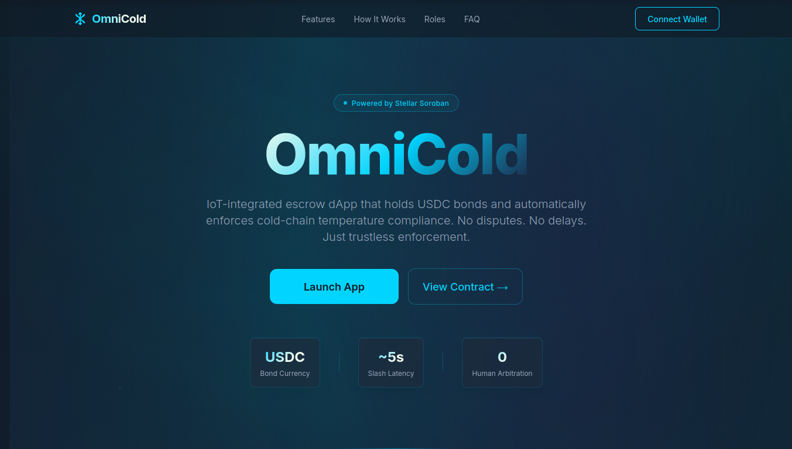
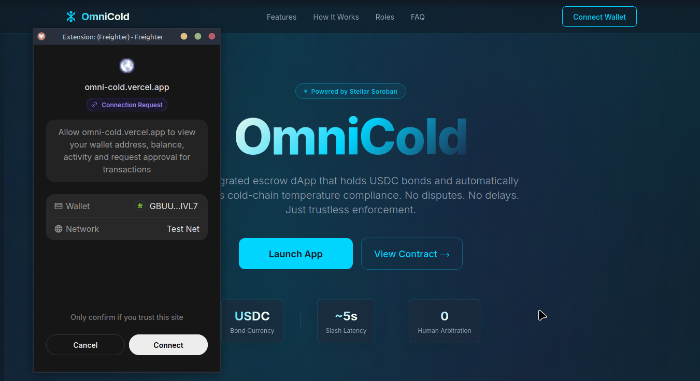
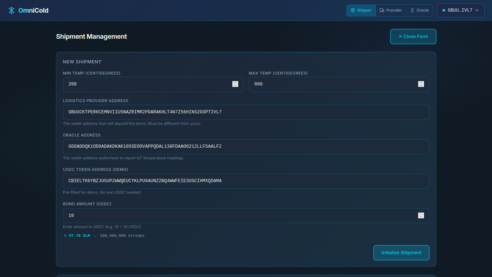
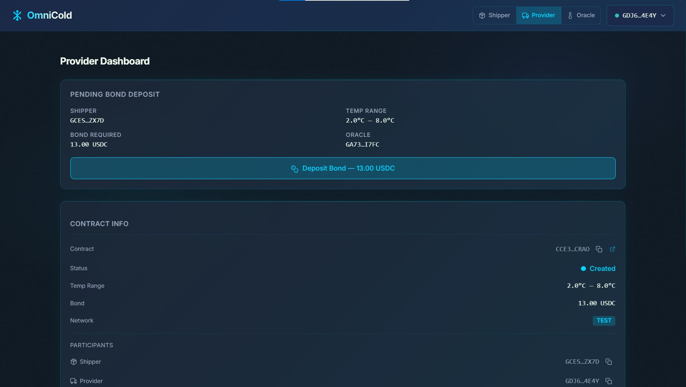
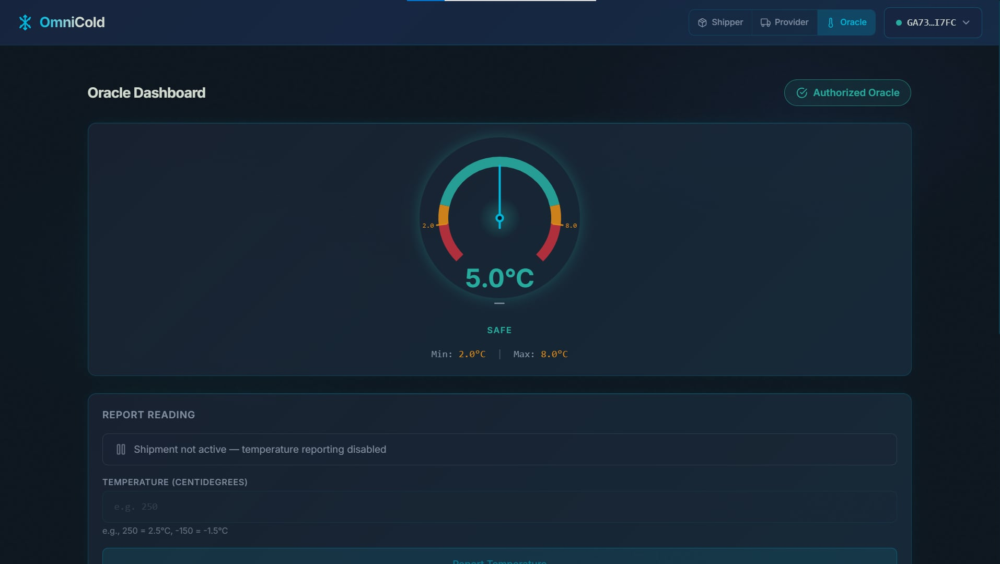
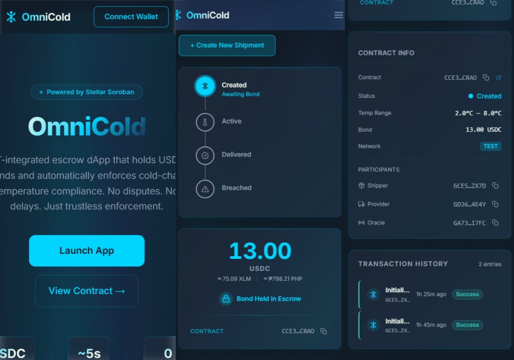
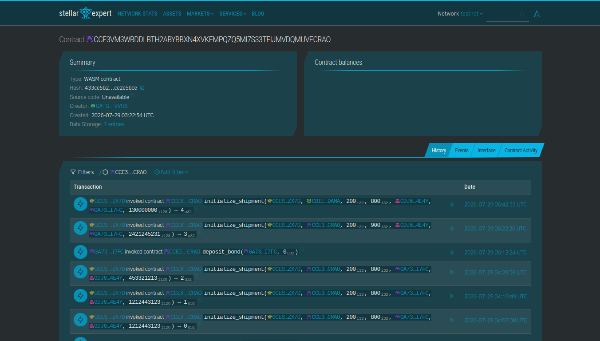

# ❄️ OmniCold

> IoT-integrated escrow dApp on Stellar/Soroban for cold-chain logistics. Automated penalty enforcement with zero human intervention.

<p align="center">
  <a href="https://stellar.expert/explorer/testnet/contract/CCE3VM3WBDDLBTH2ABYBBXN4XVKEMPQZQ5MI7S33TEIJMVDQMUVECRAO"></a>
  <a href="https://omni-cold.vercel.app"></a>
  <a href="./contracts/omnicold/src/lib.rs"></a>
  <a href="./contracts/omnicold/src/test.rs"></a>
  <a href="./LICENSE"></a>
</p>

---

## Table of Contents

- [Problem](#problem)
- [Solution](#solution)
- [🚀 Live Deployment](#-live-deployment)
- [👛 Wallet Integration](#-wallet-integration)
- [🏗️ Architecture](#️-architecture)
- [Contract Entry Points](#contract-entry-points)
- [Shipment Lifecycle](#shipment-lifecycle)
- [Currency Support](#currency-support)
- [📁 Project Structure](#-project-structure)
- [Prerequisites](#prerequisites)
- [Quick Start](#quick-start)
- [✨ Features](#-features)
- [📸 Screenshots](#-screenshots)
- [🌐 Deployed Contract](#-deployed-contract)
- [🧪 Testing](#-testing)
- [Level 1 Compliance](#level-1-compliance)
- [Level 2 Compliance](#level-2-compliance)
- [Level 3 Compliance](#level-3-compliance)
- [💡 Idea Submission](#-idea-submission)
- [📝 Submission Checklist](#-submission-checklist)
- [License](#license)

---

## Problem

Cold-chain logistics for pharmaceuticals face critical accountability gaps:

| Issue | Impact |
|-------|--------|
| **Delayed compensation** | Shippers wait weeks/months for claims to resolve |
| **Disputed sensor data** | No immutable record — providers contest readings |
| **Manual arbitration** | Expensive third-party dispute resolution |
| **No financial consequence** | No immediate penalty for violating SLAs |
| **Opaque custody** | Bond funds in accounts controlled by intermediaries |

> **$35B+** in pharmaceutical waste annually from cold-chain failures.

---

## Solution

| Traditional | OmniCold |
|-------------|----------|
| Weeks to resolve claims | ~5 second penalty enforcement |
| Disputed sensor readings | Immutable on-chain audit trail |
| Expensive arbitration | Zero human intervention needed |
| No financial consequence | Real USDC bond at stake |
| Opaque fund custody | Trustless smart contract escrow |

**How it works:**
1. Shipper creates shipment with temperature bounds (e.g., 2°C–8°C)
2. Logistics provider deposits USDC bond as guarantee
3. IoT sensors report temperatures on-chain via authorized oracle
4. Breach detected → bond atomically slashed to shipper
5. Delivery confirmed → bond released back to provider

---

## 🚀 Live Deployment

| | |
|---|---|
| **Contract ID** | `CCE3VM3WBDDLBTH2ABYBBXN4XVKEMPQZQ5MI7S33TEIJMVDQMUVECRAO` |
| **Network** | Stellar Testnet |
| **Explorer** | [View on StellarExpert](https://stellar.expert/explorer/testnet/contract/CCE3VM3WBDDLBTH2ABYBBXN4XVKEMPQZQ5MI7S33TEIJMVDQMUVECRAO) |
| **Deploy TX** | [View on StellarExpert](https://stellar.expert/explorer/testnet/tx/a0c17f7a92c42553615ac4514ebcb1cf764e243bf645bef27c3438a64adcd437) |
| **Live App** | [omni-cold.vercel.app](https://omni-cold.vercel.app) |

---

## 👛 Wallet Integration

> Full details: [WALLET_INTEGRATION.md](./WALLET_INTEGRATION.md)

| Feature | Implementation | File |
|---------|---------------|------|
| **Wallet Library** | `@stellar/freighter-api` v2.0.0 | `frontend/package.json` |
| **Connect Wallet** | `freighter.requestAccess()` → stores public key | `frontend/stores/walletStore.ts` |
| **Disconnect Wallet** | Clears address, balance, connection state | `frontend/stores/walletStore.ts` |
| **Sign Transaction** | `freighter.signTransaction(xdr, {networkPassphrase})` | `frontend/services/freighter.ts` |
| **Get Address** | `freighter.requestAccess()` returns G... address | `frontend/services/freighter.ts` |
| **Detect Wallet** | `freighter.isConnected()` checks extension | `frontend/services/freighter.ts` |
| **XLM Balance** | Fetched from Horizon `/accounts/{address}` | `frontend/stores/walletStore.ts` |
| **Connect UI** | WalletButton component in NavHeader | `frontend/components/layout/WalletButton.tsx` |
| **TX Submission** | Build XDR → Sign → Submit to Soroban RPC | `frontend/stores/contractStore.ts` |

---

## 🏗️ Architecture

| Component | Technology |
|-----------|-----------|
| Smart Contract | Rust + Soroban SDK 22.0.0 |
| Frontend | Next.js 16 + TypeScript + Tailwind CSS |
| Wallet | Freighter (Stellar browser extension) |
| Token | USDC (Stellar Asset Contract) |
| Animations | Framer Motion |
| State | Zustand + localStorage persist |
| Testing | Vitest + fast-check (PBT) |

---

## Contract Entry Points

| Function | Caller | Action |
|----------|--------|--------|
| `initialize_shipment` | Shipper | Creates shipment with temp thresholds and participants |
| `deposit_bond` | Provider | Deposits USDC bond, activates shipment |
| `report_temperature` | Oracle | Reports reading; slashes bond if out of range |
| `confirm_delivery` | Shipper | Releases bond back to logistics provider |
| `get_shipment` | Anyone | Read shipment data by ID |
| `get_shipment_count` | Anyone | Get total number of shipments |

---

## Shipment Lifecycle

```
Created ──[deposit_bond]──► Active ──[confirm_delivery]──► Delivered (bond → Provider)
                                   ──[breach detected]───► Breached  (bond → Shipper)
```

---

## Currency Support

| Currency | Usage |
|----------|-------|
| USDC | Bond deposits and slashing (on-chain) |
| XLM | Native balance display, gas fees |
| PHP | Philippine Peso conversion display |

Live rates from CoinGecko API with 60s cache.

---

## 📁 Project Structure

```
omnicold/
├── contracts/omnicold/          # Soroban smart contract (Rust)
│   ├── src/lib.rs              # Multi-shipment contract
│   └── src/test.rs             # 12 tests
├── frontend/                    # Next.js 16 dashboard
│   ├── app/                    # Pages (landing, dashboard views)
│   ├── components/             # React components
│   ├── stores/                 # Zustand (wallet, contract, UI)
│   ├── services/               # Soroban RPC, Freighter, Prices
│   ├── hooks/                  # useWallet, useContractState, usePrices
│   └── lib/                    # Types, utils, constants
├── .github/workflows/ci.yml    # CI/CD pipeline
├── demo/                        # HTML presentation (12 slides)
├── WALLET_INTEGRATION.md        # Wallet integration docs
├── scripts/deploy.sh            # Stellar CLI deployment
└── README.md
```

---

## Prerequisites

- [Rust toolchain](https://rustup.rs/)
- `wasm32-unknown-unknown` target: `rustup target add wasm32-unknown-unknown`
- [Stellar CLI](https://soroban.stellar.org/docs/getting-started/setup): `cargo install --locked stellar-cli`
- [Node.js](https://nodejs.org/) 18+
- [Freighter Wallet](https://www.freighter.app/) browser extension

---

## Quick Start

### Smart Contract

```bash
cd contracts/omnicold
stellar contract build    # Build WASM
cargo test                # Run 12 tests
stellar contract deploy --wasm target/wasm32v1-none/release/omnicold.wasm --network testnet --source <YOUR_IDENTITY>
```

### Frontend

```bash
cd frontend
npm install
npm run dev    # development server at localhost:3000
npm test       # run 10 tests
```

---

## ✨ Features

- Arctic dark theme with frosted-glass effects
- Role-based dashboard (Shipper, Provider, Oracle)
- 270° temperature gauge with spring-physics needle
- Shipment pipeline with animated state transitions
- Real-time XLM balance with USD/PHP conversion
- Bond status card with multi-currency display
- FAQ section and landing page
- Mobile responsive (hamburger nav, fluid grids)
- WCAG 2.1 AA accessible
- Toast notifications for transaction feedback
- Persistent state via localStorage

---

## 📸 Screenshots

### 1. Landing Page



> The landing page features an animated aurora background, clear value proposition, trust signals (USDC bond, ~5s slash latency, zero arbitration), and a "Launch App" CTA that triggers Freighter wallet connection.

---

### 2. Wallet Connection



> Freighter extension popup appears on connect. User approves, public key is stored, XLM balance fetched from Horizon and displayed in the nav header.

---

### 3. Shipper Dashboard — Create Shipment



> Shipper sets temperature thresholds, provider/oracle addresses, USDC token (pre-filled), and bond amount in USDC with live XLM conversion preview.

---

### 4. Provider Dashboard — Deposit Bond



> Shows pending bond deposits with shipment details. "Deposit Bond" button signs and submits the transaction. Wallet mismatch warning shows if wrong account is connected.

---

### 5. Oracle Dashboard — Report Temperature



> Temperature gauge (270° SVG arc), threshold labels, and input form. Out-of-range reports trigger automatic breach detection on-chain.

---

### 6. Mobile Responsive



> Hamburger nav, stacked cards, fluid grids. All touch targets meet 44px minimum.

---

## 🌐 Deployed Contract

- **OmniCold Soroban contract (Stellar Testnet):**

  `CCE3VM3WBDDLBTH2ABYBBXN4XVKEMPQZQ5MI7S33TEIJMVDQMUVECRAO` · [view on Stellar Expert ↗](https://stellar.expert/explorer/testnet/contract/CCE3VM3WBDDLBTH2ABYBBXN4XVKEMPQZQ5MI7S33TEIJMVDQMUVECRAO)



> Every transaction (initialize, deposit, report, confirm) is verifiable on Stellar Expert. The contract is the source of truth.

- **Live web app:** [omni-cold.vercel.app](https://omni-cold.vercel.app)

---

## 🧪 Testing

| Type | Count | Framework |
|------|-------|-----------|
| Contract tests | 12 | `soroban_sdk::testutils` |
| Frontend tests | 10 | Vitest + fast-check |
| **Total** | **22** | All passing |

---

## Level 1 Compliance

> White Belt requirements fulfilled.

| Requirement | Implementation |
|-------------|---------------|
| **Wallet Setup** | `@stellar/freighter-api`, Stellar Testnet |
| **Wallet Connect** | `freighter.requestAccess()` → stores public key |
| **Wallet Disconnect** | Clears address, balance, connection state |
| **Fetch XLM Balance** | Horizon `/accounts/{address}` endpoint |
| **Display Balance** | NavHeader wallet dropdown with USD/PHP conversion |
| **Send Transaction** | Signed XDR submitted to Soroban RPC |
| **Transaction Feedback** | Toast notifications + TxHistory component |
| **Dev Standards** | TypeScript strict, Zustand, Vitest, Tailwind |

---

## Level 2 Compliance

> Green Belt requirements fulfilled.

| Requirement | Implementation |
|-------------|---------------|
| **3+ Error Types** | 9 contract errors + wallet-not-found, user-rejected, insufficient-balance |
| **Contract Deployed** | [`CCE3VM3W...ECRAO`](https://stellar.expert/explorer/testnet/contract/CCE3VM3WBDDLBTH2ABYBBXN4XVKEMPQZQ5MI7S33TEIJMVDQMUVECRAO) |
| **Contract Called from Frontend** | Build XDR → Freighter sign → Submit to RPC |
| **Transaction Status Visible** | Pending state + polling + Toast + TxHistory |
| **2+ Meaningful Commits** | ✅ Multiple commits |
| **Real-time Integration** | PollingService + Zustand subscriptions |

---

## Level 3 Compliance

> Black Belt requirements fulfilled.

| Requirement | Implementation |
|-------------|---------------|
| **Advanced Smart Contract** | Multi-shipment factory, counter IDs, struct storage, events, TTL |
| **Inter-Contract Communication** | USDC SAC token interaction via `token::Client` |
| **Event Streaming** | Contract emits events. Frontend polls with tab-visibility awareness |
| **CI/CD Pipeline** | GitHub Actions — contract tests + frontend tests + deploy |
| **Contract Deployment** | `stellar contract build` + deploy. WASM 6.9KB optimized |
| **Mobile Responsive** | Tailwind breakpoints, hamburger nav, 44px touch targets |
| **Error Handling & Loading** | 9 error codes, SkeletonLoader, pending states, toasts |
| **Tests (3+ passing)** | **22 total** (12 contract + 10 frontend) |
| **Production Architecture** | TypeScript strict, Zustand persist, service layer, env configs |
| **Documentation & Demo** | README, WALLET_INTEGRATION.md, 12-slide HTML demo |

### Test Output

```
Contract: 12 passed; 0 failed
Frontend: 10 passed (1 test file)
Total:    22 tests passing
```

### CI/CD Pipeline

| Job | Action |
|-----|--------|
| Contract Build & Test | `cargo test` + WASM build |
| Frontend Build & Test | `tsc --noEmit` + `npm test` |
| Deploy | Auto-deploys to Vercel on main |

---

## 💡 Idea Submission

### 1. Problem Statement

Cold-chain logistics lacks trustless penalty enforcement. Manual claims, delayed arbitration, opaque sensor data. **$35B+** annual pharma waste.

### 2. Why Stellar?

| Feature | Benefit |
|---------|---------|
| Native USDC | Real dollars, Circle-issued |
| 5-second finality | Breach → slash in one block |
| Sub-cent fees | ~$0.0001/tx |
| Soroban | Rust + WASM, deterministic |
| Enterprise | MoneyGram, Circle, Wise |

### 3. Target Users

| User | Role |
|------|------|
| Pharma Distributors | Shipper — instant compensation on breach |
| Cold-Chain Providers | Provider — competitive differentiation via bond |
| IoT Operators | Oracle — recurring revenue |
| Cargo Insurers | Observer — reduced claims costs |

### 4. Architecture

```
Next.js (Vercel) ←→ Soroban RPC ←→ Stellar Validators ←→ OmniCold Contract
       ↕
  Freighter Wallet
```

### 5. Complexity

1. Atomic multi-party token transfers
2. Irreversible state machine
3. IoT-to-blockchain oracle problem
4. Soroban TTL management
5. i128 WASM arithmetic
6. XDR type marshalling

### 6. Roadmap

| Phase | Status |
|-------|--------|
| MVP | ✅ Complete |
| Pilot | Next |
| Multi-Oracle | Planned |
| Mainnet | Planned |

---

## 📝 Submission Checklist

| Item | Status |
|------|--------|
| Public GitHub repository | ✅ |
| README with complete docs | ✅ |
| 10+ meaningful commits | ✅ |
| Live demo | [omni-cold.vercel.app](https://omni-cold.vercel.app) |
| Contract address | `CCE3VM3WBDDLBTH2ABYBBXN4XVKEMPQZQ5MI7S33TEIJMVDQMUVECRAO` |
| Transaction hash | [View](https://stellar.expert/explorer/testnet/tx/a0c17f7a92c42553615ac4514ebcb1cf764e243bf645bef27c3438a64adcd437) |
| Mobile responsive | ✅ |
| CI/CD pipeline | ✅ `.github/workflows/ci.yml` |
| 3+ passing tests | ✅ 22 tests |
| Demo | [HTML Demo](./demo/index.html) |

---

## License

MIT
